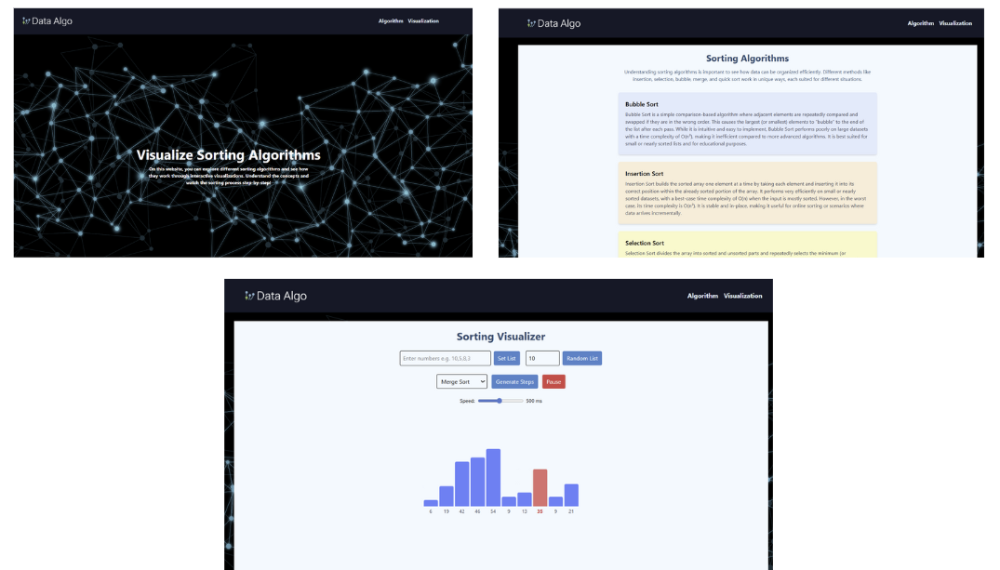

# 🔢 dsa-algo-Visualizer

An interactive web app to **visualize classic sorting algorithms** step by step.  
Built with **React (Vite) + TailwindCSS**.  

🎥 Watch how arrays are sorted in real-time with animations, comparisons, and highlights.

---

## 🚀 Demo Screenshot



*(Replace with your actual screenshot file — add it to `public/` and push to GitHub)*

---

## ✨ Features

- 📊 Visualizes multiple sorting algorithms:
  - Bubble Sort
  - Insertion Sort
  - Merge Sort
  - Selection Sort
  - Quick Sort
- 🎲 Generate random arrays or input your own numbers
- ⏯ Play / Pause animations
- ⚡ Adjustable animation speed
- 🔎 Highlights comparisons and swaps
- ✅ Displays numbers directly under bars

---

## 🛠 Tech Stack

- **React (Vite)** – frontend framework  
- **TailwindCSS** – styling  
- **JavaScript (ES6)** – algorithms & logic  

---

## 📦 Installation

Clone the project and install dependencies:

```bash
cd dsa-algo-Visualizer
npm install
